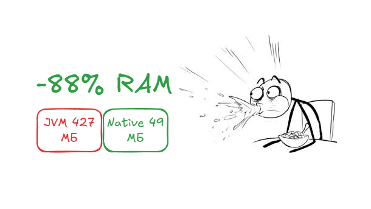
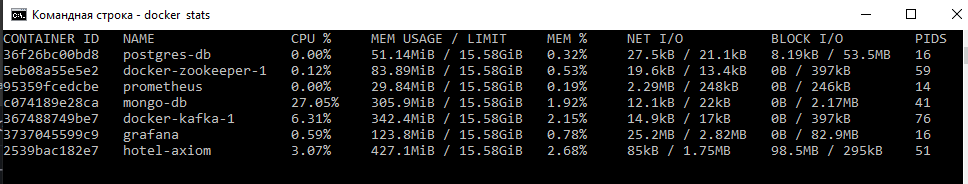
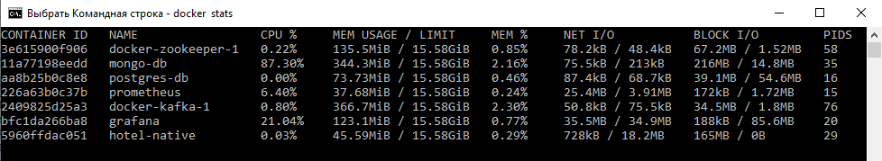
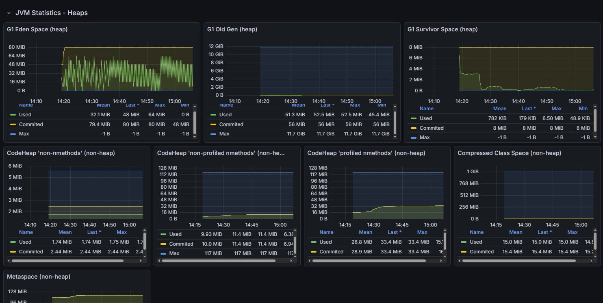
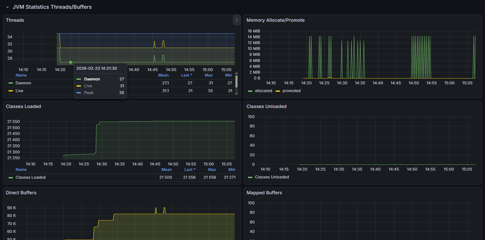
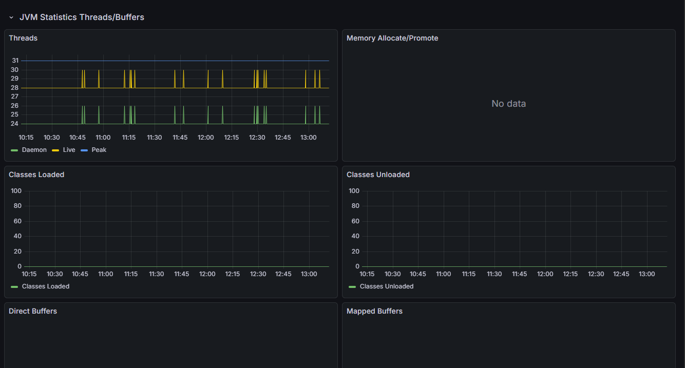
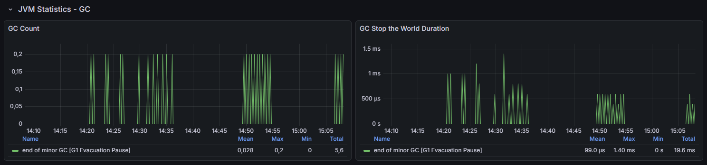
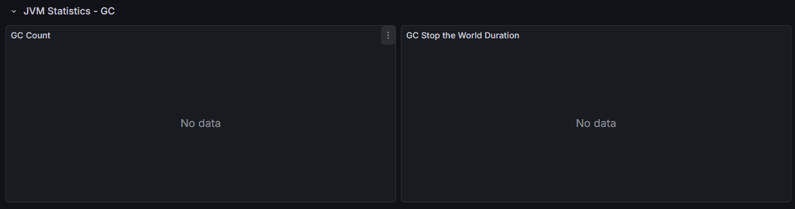

[📖 Читать полную версию на Habr](https://habr.com/ru/sandbox/273964/)
# Java на диете: 45 МБ RAM и старт за 1.4 с. 🚀
## Смертный приговор классическим JVM? 💀

    

> **Этот репозиторий содержит материалы исследования по экстремальной оптимизации Java-стека.**

Когда я впервые увидел, как мой сервис на Spring Boot с Postgres, MongoDB и Kafka "съел" всего 45 МБ оперативной памяти, я почувствовал азарт. Азарт инженера, который нашёл способ обмануть систему. Я был заряжен Axiom NIK: его эффективностью, его агрессивной компиляцией и тем, как он превращает "жирный" корпоративный стек в изящный бинарник.

Многие годы нам вдалбивали: "Java – это прожорливо!". Нам говорили: "Выдели 2 ГБ под микросервис, иначе JIT не прогреется".

Забудьте об этом! Я провёл R&D, который ставит точку в спорах о прожорливости Java!

Это не просто тесты. Это вскрытие!

---

### Содержание

1. [Стек "Hotel Service"](#стек-hotel-service)
2. [Docker Stats: расстановка сил](#docker-stats-расстановка-сил)
3. [Heaps: Пила против Прямой](#heaps-пила-против-прямой)
4. [Классы и Потоки: Статика против Динамики](#классы-и-потоки-статика-против-динамики)
5. [Garbage Collector: Хирургическая тишина против "остановки мира"](#garbage-collector-хирургическая-тишина-против-остановки-мира)
6. [Битва в цифрах: JRE vs Native Image](#битва-в-цифрах-jre-vs-native-image)
7. [25 Технических выводов: Почему это революция](#25-технических-выводов-почему-это-революция)

## Стек "Hotel Service"
Чтобы не играть в поддавки, я взял полноценный стек:
- Java 21 + Project Loom (виртуальные потоки).
- Spring Boot 3.5 + Hibernate 6.6 (Bytecode Enhancement).
- Инфраструктура: Postgres 17, MongoDB 7, Kafka 3.x.
- Битва рантаймов: Axiom JDK (HotSpot) против Axiom NIK (Native Image).

## Визуальное вскрытие: как это выглядит в рантайме
Перед тем как перейти к таблицам, посмотрите на "кардиограмму" системы.

Слева – классическая мощь HotSpot, справа – нативная диета Axiom NIK.

### Docker Stats: расстановка сил

|            Axiom JRE (HotSpot)            |           Axiom NIK (Native Image)           |
|:-----------------------------------------:|:--------------------------------------------:|
|  |  |

> Здесь всё на ладони. Пока JRE-версия (hotel-axiom) борется за выживание, потребляя 427 MiB, нативный бинарник (hotel-native) скромно занимает 49MiB, становясь самым лёгким элементом инфраструктуры – легче Postgres и в 8 раз легче Kafka.

### Heaps: Пила против Прямой

|                Axiom JRE (HotSpot)                 |              Axiom NIK (Native Image)               |
|:--------------------------------------------------:|:---------------------------------------------------:|
|  |  |

> Классическая "пила" Eden Space в JVM против идельно ровной линии в Native. Обратите внимание на Non-Heap: в нативном образе его просто нет. Мы выкинули сотни мегабайт "инфраструктурного мусора".

### Классы и Потоки: Статика против Динамики

|                      Axiom JRE (HotSpot)                      |                   Axiom NIK (Native Image)                    |
|:-------------------------------------------------------------:|:-------------------------------------------------------------:|
|   |  |

> Шок-контент для Java-разработчика: 0-loaded-classes. В рантайме Native Image классов не существует. Количество системных потоков сокращено вдвое (26 против 55) благодаря синергии Native и Loom.

### Garbage Collector: Хирургическая тишина против "остановки мира"

|              Axiom JRE (HotSpot)               |             Axiom NIK (Native Image)             |
|:----------------------------------------------:|:------------------------------------------------:|
|   |  |

> На графиках GC Stop the World Duration в Native-режиме – мёртвая тишина. Пока нативный бинарник на базе Axiom NIK шёл ровным потоком, классическая JVM под нагрузкой устроила настоящую чечётку. За время теста мы зафиксировали более 50 циклов сборки мусора (G1 Evacuation Pause) 19.6 мс. В Axiom NIK по умолчанию трудится Serial GC, и он делает это настолько филигранно, что система мониторинга просто не фиксирует пауз. Это не просто экономия памяти – это безупречный, предсказуемый SLA без микро-задержек на "самообслуживание" рантайма.

## Битва в цифрах: JRE vs Native Image

Я подал нагрузку в 1000 запросов на оба варианта. Результаты заставили меня перепроверять источники.

| Метрика           | Axiom JRE (HotSpot) | Axiom NIK (Native) | Профит             |
|-------------------|---------------------|--------------------|--------------------|
| Startup time      | 16.03 сек           | **1.46 сек**       | X11 Быстрее        |
| Ram (idle)        | 427.1 MiB           | **49.1 MiB**       | - 88.5% RAM        |
| Ram (Stress Load) | 463.2 MiB           | **41.8 MiB**       | Native стал легче! |
| Loaded Classes    | 21282               | **0**              | Чистая статика     |
| System Threads    | 55                  | **29**             | В 2 раза легче     |
| STW Pauses        | 19.6 ms             | **~0ms**           | Идеальный SLA      |

## 25 Технических выводов: Почему это революция
Ниже – всё, что я увидел на графиках Prometheus и в логах системы. Без прикрас.

> Анализ графиков Prometheus и логов системы без прикрас.

<b>Инфраструктура и Память</b>

1.	**Смерть Metaspace:** В Native-версии 0 загруженных классов в рантайме. Мы сэкономили 111 МБ только на том, что выкинули описание структур классов.
2.	**Нулевой Code Cache:** В JRE JIT-компилятор откусил 33 МБ под "горячий" код прямо во время теста. В Native этот показатель – 0. Код "запечён" в бинарник.
3.	**Парадок нагрузки:** Под стресс-тестом Native-образ стал потреблять меньше памяти (с 40 до 41 МБ). Serial GC в Axiom NIK работает хирургически точно.
4.	**Плотность (Density):** Там, где вы запускали 1 севрис на JRE, теперь влезет 11 инстансов на Native. Это сокращение ТСО на порядок.
5.	**Non-Heap как фантом:** В JRE Non-Heap область сама по себе весит в 3.5 раза больше, чем всё наше нативное приложение целиком.
6.	**Compresses Class Space:** Ещё 15 МБ "налога на динамику", который Native просто не платит.

<b>Производительность и Latency</b>

7.	**Мгновенный старт:** 1.4 секунды – это не просто быстро. Это готовность к Serverless и Scale-to-Zero.
8.	**Холодный старт сетевого стека:** Мой WarmupService пробил стену латентности. Первый запрос в Native – 870мс, втором – 12.5 мс.
9.	**JIT-инерция:** JVM-версии нужно время на "раскачку". Native выдаёт пиковую скорость с первой миллисекунды.
10.	**Микро-латентность БД:** Время получения коннекта из пула HikariCP в Native составило ~250 мкс против 800 мкс в JRE.
11.	**Throughput:** После прогрева JRE выдала 10.8мс, но Native шёл вровень (12.5мс), потребляя в 10 раз меньше ресурсов.
12.	**Отсутствие STW-пауз:** Пока JRE 5 раз "замораживала мир" на общую сумму 20 мс, Native шёл плавным потоком.

<b>Архитектура и Runtime</b>

13.	**Project Loom:** Виртуальные потоки в Native потребляют в 2 раза меньше системных дескрипторов (29 PIDS против 55).
14.	**Hibernate AOT:** Bytecode Enhancement на этапе сборки – единственный способ сохранить Lazy Loading в Native и не сойти с ума.
15.	**Чистота рантайма:** Ноль ошибок рефлексии в логах. Если Native собрался – он работает как швейцарские часы.
16.	**Смерть ClassLoader:** Мы избавились от самой медленной и небезопасной части JVM.
17.	**Static Metamodel:** Никаких динамических прокси. Весь маппинг сущностей опеределён в compile-time.
18.	**Безопасность:** В нативном образе нет возможности подгрузить вредосносный байт-код в рантайме.

<b>Наблюдаемость (Observability)</b>

19.	**Шизофрения мониторинга:** Стандартные дашборды Grafana сходят с ума, показывая "отрицательный" Heap в Native. Нативный рантайм требует новых метрик.
20.	**Прозрачность логов:** SLF4J + Logback работают в Native без накладных расходов на динамическую конфигурацию.
21.	**Zero-Overhead мониторинг:** Prometheus скрейпит метрики нативного образа за микросекунды.
22.	**Direct Buffers:** В Native управление буферами Netty происходит эффективнее на уровне ОС.
23.	**Сборка как фильтр:** Если в вашем коде есть "грязные" зависимости, Native-компилятор их просто не пропустит.

<b>Экономика и Деплой</b>

24.	**Размер образа:** Axiom NIK (Alpaquita/musl) сэкономил 140 МБ по сравнению с Vanilla Native на Debian.
25.	**CI/CD трейд-офф:** за старт в 1.4 с мы платим 13 минутами сборки. Это цена, которую я готов платить за идеальный рантайм.

## Вместо выводов
Я не буду отвечать в комментариях. Я не буду спорить о том, "нужно ли это в продакшене".

Перед вами цифры. Перед вами графики. Перед вами реальность 2026 года. Java перестала быть "тяжёлой". Она стала эффективнее Go, оставаясь при этом мощным Spring-инструментом.

Хотите – используйте! Хотите – защищайте старый добрый HotSpot!

А я пошёл деплоить ещё десять инстансов на те ресурсы, которые вы тратите на один.

**Adios!**

---

## P.S. Попробуй сам
Для тех, кто привык доверять только своим глазам и терминалу: весь код, Docker-файлы для всех 5 типов сборок (Axiom, Vanilla, Layers, Native, Uber-jar) и настроенный стек мониторинга (Prometheus/Grafana) доступны в репозитории.

Повторите эксперимент, подайте нагрузку и убедитесь сами:
1. `git clone https://github.com/GroteskSerega/hotel`
2. `docker-compose up -d`
3. Открой Grafana на `localhost:3000` и смотри, как твоя Java "худеет" на глазах.

**GitHub:** https://github.com/GroteskSerega/hotel
